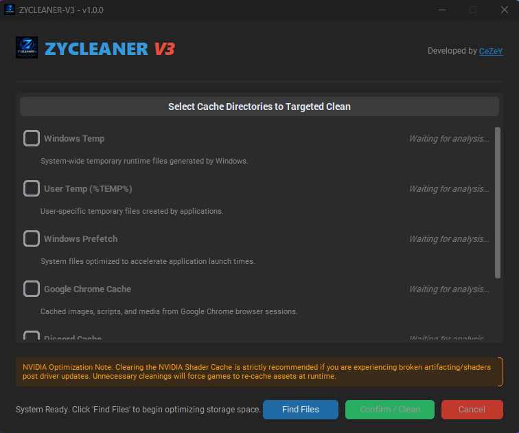

# ⚡ ZYCLEANER V3

**ZYCLEANER V3** is a sleek, highly optimized, and lightweight system cache cleaning utility. Completely rewritten in Python with a modern dark-themed GUI, it helps you safely free up storage space by targeting hidden junk files, temporary folders, and app caches that Windows leaves behind.

---

## ✨ Key Features

* **Modern & Responsive UI:** Built using `CustomTkinter` for a clean, dark-mode aesthetic that never freezes during scans thanks to asynchronous multi-threading.
* **Smart Cache Detection:** Specifically targets high-bloat areas including:
  * Windows Temp & User `%TEMP%`
  * Windows Prefetch
  * Google Chrome Cache
  * Discord Cache
  * NVIDIA Shader Cache
* **Granular Control:** ZYCLEANER lets you scan first, view exactly how much space each directory occupies, and manually check/uncheck what you want to delete.
* **Safe Deletion Engine:** Gracefully handles locked or in-use files, skipping them safely without crashing the application.
* **Built-in Logging:** Generates a background diagnostic log in `AppData/Roaming/ZYCLEANER-V3` for easy troubleshooting.
* **Update Checker:** Automatically pings GitHub to notify you if a newer version is available.

---

## 🚀 How to Use

1. Launch **`ZYCLEANER_V3.exe`**.
2. Accept the Windows UAC (Administrator) prompt.
3. Click the **Find Files** button. The engine will scan your system and calculate the size of your cache directories.
4. Review the results in the main panel. Check the boxes next to the directories you wish to wipe.
5. Click **Confirm / Clean** to purge the selected files.
6. Enjoy

---

## ⚠️ Important Notes
**NVIDIA Shader Cache:** ZYCLEANER V3 includes the ability to clear NVIDIA DirectX caches. Please note that clearing this cache is strictly recommended *only* if you are experiencing visual artifacts or stutters after a driver update. Unnecessary clearing will force your games to recompile shaders, which can cause temporary micro-stutters.

---

## 👨‍💻 Credits
* **Developer:** [CeZeY (CazymirTM)](https://github.com/CazymirTM)
* **UI Designer:** AlexXZrZ
